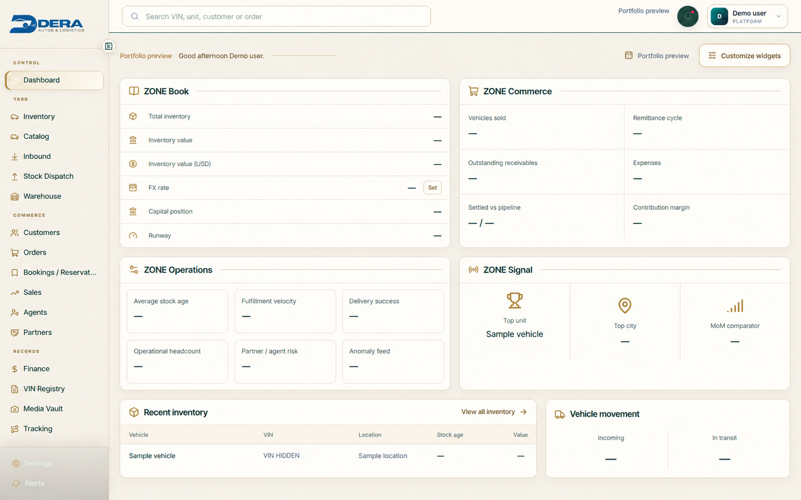
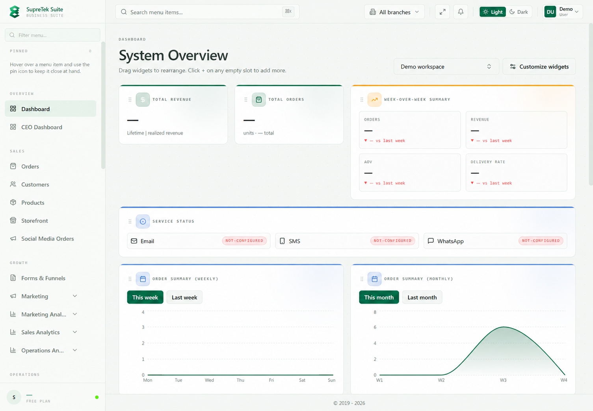
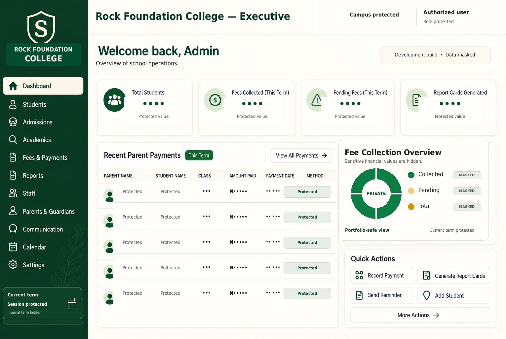
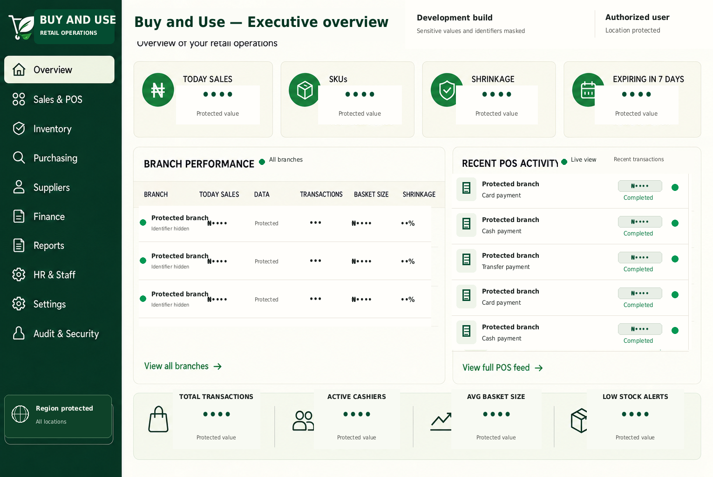

# Harrison Madu

**Know what sold. What's in stock. Where the money went.**

Full-stack engineer with 6 years of professional experience. I build custom ERP, CRM, inventory, reporting, and business operations systems for organizations that need better control of their workflows and data.

I design the interface, build the backend, and hand over a system a team can use daily: sales, stock, customers, and reports in one place.

[Explore my portfolio](https://harrisonmadu.github.io/Portfolio/) · [Discuss your project](mailto:dardtechsystems@outlook.com)

## What I build

- Inventory and stock systems
- Custom CRM and client tracking
- ERP modules for operations and reporting
- Dashboards for cash, sales, and performance
- Web apps from frontend to backend
- School-management systems and executive dashboards

## Skills and technologies

- **Frontend:** React, Next.js, TypeScript, JavaScript, HTML5, CSS3, Tailwind CSS, responsive UI, and UI/UX implementation.
- **Backend and APIs:** Node.js, NestJS, REST APIs, authentication, role-based access control, API integrations, and server-side validation.
- **Database and data:** PostgreSQL, Prisma ORM, SQL, database design, data modelling, Python, Streamlit, Plotly, and Power BI.
- **Tools and delivery:** Git, GitHub, Visual Studio Code, Postman, Figma, CI/CD workflows, GitHub Actions, and deployment support.

## Selected work

### Dera Auto — vehicle inventory and operations

A shared workspace for vehicle stock, import logistics, reservations, sales, and finance.

*Anonymized screenshot from the deployed system. Internal values and identifiers are masked.*

- **Problem:** Connect each vehicle's purchase, shipping, clearing, warehouse placement, and eventual sale with its costs and payments.
- **What I built:** VIN-based stock records, movement tracking, reservations, payment and approval workflows, a vehicle media vault, and a customizable dashboard.
- **Stack:** Next.js, React, TypeScript, PostgreSQL, Prisma.
- **Status:** Deployed.

### SupreTek Suite CRM — business operations platform

Implementation and integration work across order management, grouped product pricing, customer records, and business reporting.

*Anonymized screenshot from the deployed system. Internal values and identifiers are masked.*

- **Problem:** Give sales and operations teams a consistent view of orders, customers, product offers, and business reporting.
- **My work:** Connect the existing CRM interface to a NestJS and PostgreSQL backend, with work across order status filters, product pricing groups, customer records, and configurable business dashboards.
- **Stack:** React, TypeScript, NestJS, PostgreSQL, Prisma.
- **Status:** Deployed.

### Rock Foundation College — school management system

*Portfolio-safe screenshot from the development build. Sensitive values and identifiers are masked.*

- **Problem:** Give school leaders a clear view of student records, fees collected, outstanding balances, and academic administration.
- **What I built:** Student records, fee and payment tracking, outstanding-fee visibility, report-card access, and parent communication workflows.
- **Focus:** Executive visibility, fee collection, student administration, and operational reporting.
- **Status:** Development build.

### Buy and Use — retail operations system

*Portfolio-safe screenshot from the development build. Sensitive values and identifiers are masked.*

- **Problem:** Connect sales activity with branch performance, stock availability, shrinkage, and approaching expiry dates.
- **What I built:** Sales recording, stock updates, low-stock and expiry alerts, and branch performance reporting.
- **Focus:** Sales and POS, inventory, branch reporting, and executive visibility.
- **Status:** Development build.

### More full-stack and product case studies

- **[CEO Dashboard](https://harrisonmadu.github.io/Portfolio/projects/ceo-dashboard/)** — configurable executive reporting for capital, burn, receivables, runway, and product performance.
- **[Ad Performance Dashboard](https://harrisonmadu.github.io/Portfolio/projects/ad-performance-dashboard/)** — interactive Python, Streamlit, and Plotly reporting application.
- **[Buy and Use Commerce Experience](https://harrisonmadu.github.io/Portfolio/projects/buy-and-use/)** — responsive product journey, order capture, and commerce-workflow integration.
- **[SupremeLife Commerce Experience](https://harrisonmadu.github.io/Portfolio/projects/supremelife/)** — responsive product page, form behaviour, and customer-to-operations handoff.

## How we can work together

1. **Understand the work:** Review your process, users, tools, and biggest pain points.
2. **Agree the scope:** Define the screens, features, responsibilities, and priorities.
3. **Build and review:** Review the interface and workflows as the system takes shape.
4. **Test and hand over:** Check the agreed workflows and prepare documentation and handover.

Features, integrations, data import, hosting, ownership, and support are agreed as part of the project scope.

For a first conversation, share your business type, the workflow problem, key features, target date, and budget range if known.

## Contact

- Email: [dardtechsystems@outlook.com](mailto:dardtechsystems@outlook.com)
- GitHub: https://github.com/HarrisonMadu
- LinkedIn: https://www.linkedin.com/in/harrison-madu-7555b3349
- X: [@smaldard](https://x.com/smaldard)
- **Hire me on Fiverr:** Profile coming soon. For projects started on Fiverr, communication and payments stay on Fiverr.
